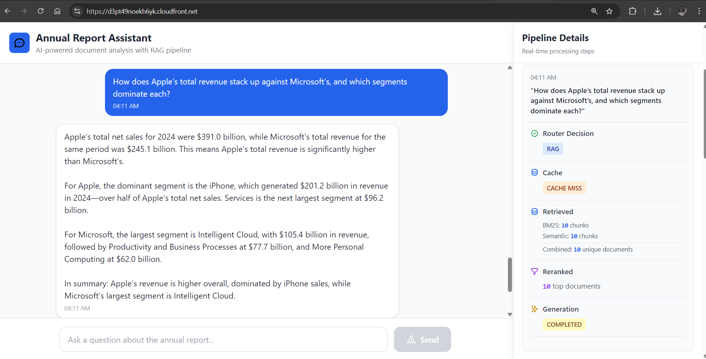
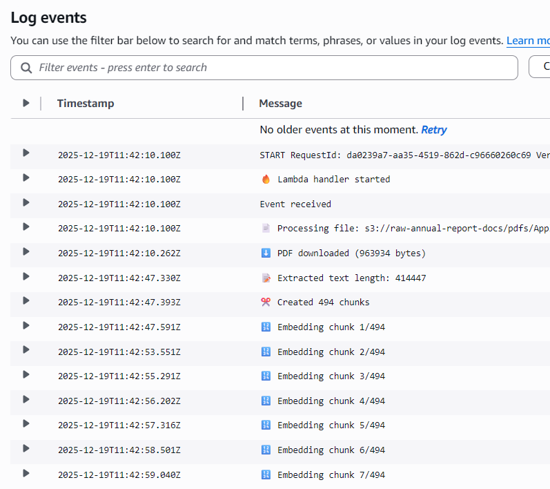
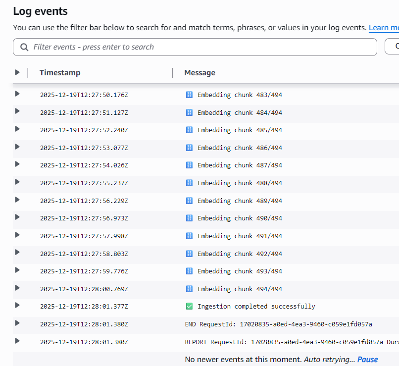
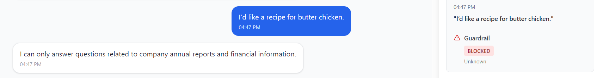
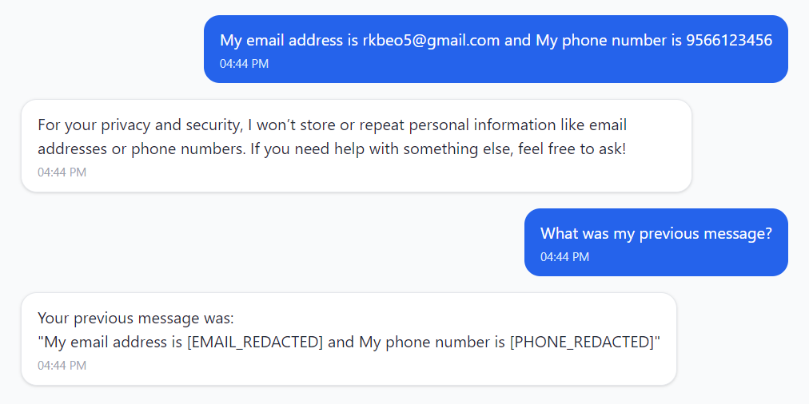

# Annual Report RAG Chatbot 
An end-to-end Retrieval-Augmented Generation (RAG) system for answering analytical questions over company annual reports.


## Architecture Overview 
- Frontend: Static UI hosted on S3, delivered via CloudFront  
- Backend: FastAPI + Gunicorn API behind Application Load Balancer (ALB)  
- Retrieval: OpenSearch (BM25 + dense vectors)  
- Reranking: Cross-encoder–based reranker (top-k refinement)  
- Caching: ElastiCache Redis (LLM response & routing cache)  
- Infra / Ops: Docker, AWS EC2, CloudFront, ALB  


## Architecture Diagram 


## Output Images 

#### AWS CloudFront Deployment



#### Lambda Ingestion: S3 → OpenSearch

<p align="center">
  
  
</p>

#### Guardrails 

**Off-topic guardrail**  


**Token-level redaction**  


#### Cache Hit (AWS ElastiCache)


## Folder Structure

```text
.
├── assets/                    # Architecture diagrams & output screenshots
│
├── backend_server/            # FastAPI backend
│   └── app.py                
│
├── front_end/                 # Static frontend
│   └── index.html             
│
├── notebooks/                 # Development & experimentation notebooks
│
├── src/                       # Core RAG logic
│   ├── aws_infra/             # AWS-related components
│   │   ├── lambda_ingestion/  # S3 → OpenSearch ingestion
│   │   │    └── ingestion.py
│   │   └── opensearch/        # OpenSearch client & helpers
│   │        ├── client.py
│   │        └── index_mapping.json 
│   ├── caching.py            
│   ├── generation.py         
│   ├── guardrails.py          
│   ├── memory.py              
│   ├── prompts.py            
│   ├── rerankers.py           
│   ├── retrieval.py           
│   └── router.py              
│
├── .dockerignore
├── .gitignore
├── Dockerfile                 # Backend container image
├── README.md                  # Project documentation
├── main.py                    # RAG pipeline entry point (router → retrieval → rerank → generate)
├── requirements.txt           # Python dependencies
└── .env                       # Environment variables (not committed)
```
## Acknowledgments

This project leverages the following tools and platforms:

- **FastAPI** for building the backend API  
- **Gunicorn** for production-grade ASGI serving  
- **OpenSearch** for hybrid retrieval (BM25 + vector search)  
- **Redis (ElastiCache)** for caching LLM responses and routing decisions  
- **Docker** for containerization  
- **AWS EC2** for backend hosting  
- **Application Load Balancer (ALB)** for traffic management  
- **Amazon S3** for static frontend hosting  
- **Amazon CloudFront** for CDN and secure content delivery  


## License

[](https://opensource.org/licenses/MIT)

This project is licensed under the **MIT License**.  
See the [LICENSE](LICENSE) file for details.

## Contributing

Contributions are welcome — please open an issue or submit a pull request with a clear description of your changes.